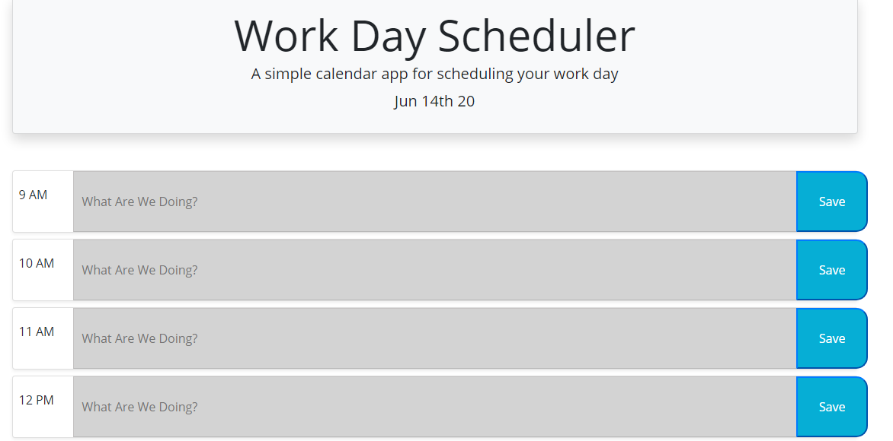
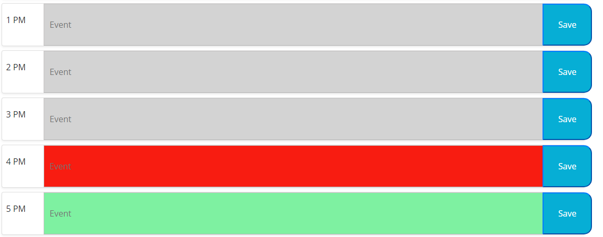

# Day-Planner

This application assists users to set their calender plan for the day.
Using localstorage to store tasks.

To clear the events in one go.
Please proceed to console and use the following command:
localstorage.clear()

Deployed Application:

https://pokoshih.github.io/Day-Planner/